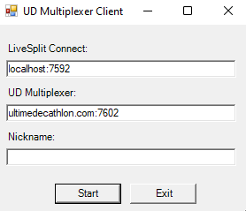

# LiveSplit connector for Ultimate Decathlon

_Pour une version française du guide, suivre [ce lien](README.md)_

This pack contains a connector to link LiveSplit and the Ultimate Decathlon multiplexer.
Its goal is to collect in real time all LiveSplit (game, time, segments...) information during races and tournaments.

## Installation

Download [the latest version](https://github.com/fuhrmannb/ud-livesplit-connector-pack/releases) (click on the file named `ud-livesplit-connector-pack_vX.Y.Z.zip`) and extract:

* content of the `LiveSplit.Connect` folder inside the `Components` folder of LiveSplit folder installation;
* `multplixer-client` folder wherever your desire on your system.

## Setup LiveSplit Connect component

_To be setup only once. If you manage multiple layouts, this operation has to be done for each layout._

1. Start LiveSplit and edit layout:

2. Add component _LiveSplit Connect_ located in _Control_ category:

3. After a double click on _LiveSplit Connect_, tick _Start server on launch_ and _Read Only_ checkboxes:

4. Save your layout and restart LiveSplit to take changes into account.

_For curious people, this LiveSplit component allows remote access of LiveSpit features. More details can be found [here](https://github.com/fuhrmannb/LiveSplit.Connect)._

## Start multiplexer client for UD

_This operation has to be done before each race or tournament._

Before each event that needs to connect your timer to the UD multiplexer, you have to start the multiplexer client following these instructions:

1. In the `multiplexer-client` folder, double click on `ud-multiplexer-client.bat`.

2. The following window opens:

     

   Don't change the first two fields. Specify your **Twitch login** in the _Nickname_ field.

   _Note: At the next program startup, the fields will already been filled._

3. Press _Start_. The program is launching. **Don't close the terminal window** (you can minimize it). Your timer is connected to the UD server, congratulations!

To disconnect, just close the terminal window.

_For curious people, this program establishs a link between the previous setup LiveSplit component to the multiplexer server installed on UD server. More details can be found [here](https://github.com/fuhrmannb/grpc-multiplexer/)._

## In case of issue

* Don't close the terminal of the multiplexer client. It can contain useful information for debugging the issue.
* Contact a UD administrator.
* You may be asked to install [DebugView](https://docs.microsoft.com/fr-fr/sysinternals/downloads/debugview) software if the source of the bug comes from the LiveSplit Connect component.

# You want to contribute?

Developers, you found a bug of a possible improvement? Pull requests are welcome! For major changes, please open an issue first to discuss what you would like to change.
