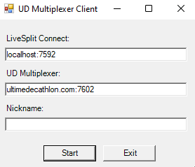

# Pack pour connecter LiveSplit au serveur de l'Ultime Décathlon

_For an English version of the guide, follow [this link](README.en.md)_

Ce pack contient un connecteur qui relie LiveSplit et le multiplexer de l'Ultime Décathlon.
Celui-ci permet de récupérer en temps réel les informations du LiveSplit (jeu, temps, segments...) durant les races et tournois.

## Installation

Télécharger [la dernière version](https://github.com/fuhrmannb/ud-livesplit-connector-pack/releases) (cliquer sur le fichier s'appellant `ud-livesplit-connector-pack_vX.Y.Z.zip`) et extraire:

* le contenu du dossier `LiveSplit.Connect` dans le dossier `Components` de l'installation de LiveSplit ;
* le dossier `multiplexer-client` à l'endroit de votre choix.

## Mise en place du composant LiveSplit Connect

_À ne faire qu'une seule fois. Si vous avez plusieurs layouts, cette opération est à réaliser pour chaque layout._

1. Lancer LiveSplit et éditer le layout:

2. Ajouter le composant _LiveSplit Connect_ se trouvant dans la catégorie _Control_:

3. Après un double-click sur _LiveSplit Connect_, cocher _Start server on launch_:

4. Sauver votre layout et redémarrer LiveSplit pour prendre en compte les changements.

_Pour les curieux, ce composant LiveSplit permet d'accéder à distance aux fonctionnalités de LiveSplit. Plus de détails [ici](https://github.com/fuhrmannb/LiveSplit.Connect)._

## Lancement du client multiplexeur pour l'UD

_Opération à réaliser avant chaque tournoi ou utilisation de l'outil de race de l'UD (bot Discord)._

Avant chaque tournoi ou autre événement nécessitant de connecter le timer sur le multiplexeur de l'UD, il est nécessaire de lancer le client multiplexeur.

1. Dans le dossier `multiplexer-client`, double-cliquer sur `ud-multiplexer-client.bat`.

2. La fenêtre suivante s'ouvre:

    

   Ne pas changer les deux premiers champs. Inscrire son pseudo dans le champ _Nickname_ (**le pseudo doit être le même que celui du site web de l'UD**).

   _Note: à la prochaine ouverture du programme, ces informations seront déjà renseignées._

3. Cliquer sur _Start_. Le programme se lance. **Ne pas fermer la console** (vous pouvez la réduire). Votre timer est connecté au server de l'UD, félicitations !

Pour se déconnecter, il suffit simplement de fermer la console.

_Pour les curieux, ce programme permet de connecter le composant précédent de LiveSplit au server multiplexeur installé sur le servuer de l'UD. Plus de détails [ici](https://github.com/fuhrmannb/grpc-multiplexer/)._

## En cas de soucis

* Ne pas fermer la console du client multiplexeur, elle peut contenir des informations utiles pour trouver la source du problème.
* Contacter un administrateur de l'UD.
* Vous serez peut-être demander à utiliser le logiciel [DebugView](https://docs.microsoft.com/fr-fr/sysinternals/downloads/debugview) si l'origine du problème vient du composant LiveSplit Connect.

## Vous voulez contribuer ?

Développeur, vous avez trouvé un bug ou une amélioration possible ? N'hésitez pas à proposer une _Merge Request_ dans ce repository !
